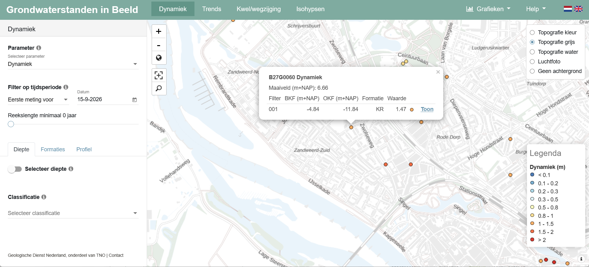
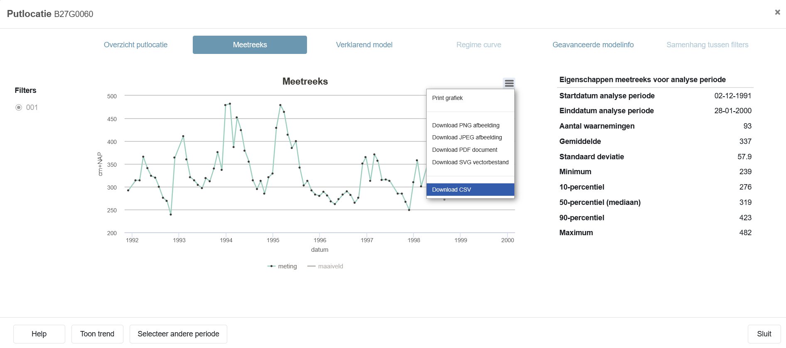
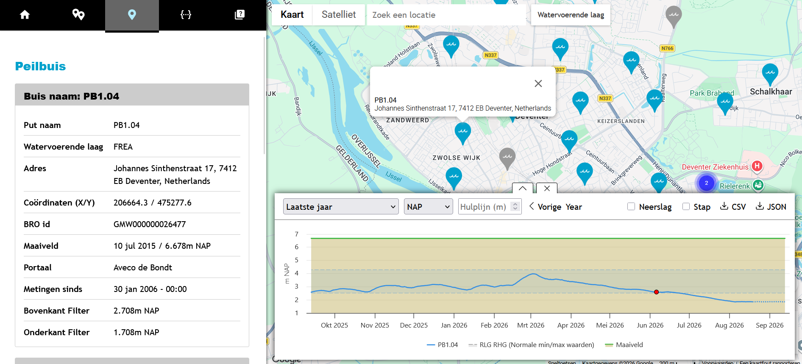
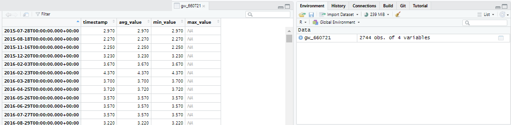
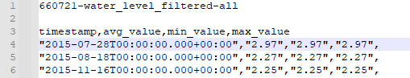
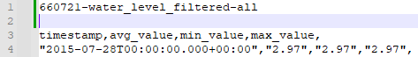

# Projecten in RStudio

We gaan eerst even leren werken in RStudio. Dit is een gratis en open-source geïntegreerde ontwikkelomgeving (IDE) voor R. Hierin is het belangrijk om met projecten te werken, omdat dit programmeren in R eenvoudiger en sneller maakt. Als je in een project werkt, wordt de werkdirectory automatisch ingesteld; iets wat je handmatig moet doen wanneer je R-scripts buiten projecten om schrijft. De eerste stap om aan een nieuw onderzoek te beginnen, is dus RStudio openen en vervolgens een nieuw project aan te maken.

De stappen die je daarvoor moet zetten, staan heel goed uitgelegd op de website van de makers: <https://support.posit.co/hc/en-us/articles/200526207-Using-RStudio-Projects>. Volg die stappen dus voor opdracht 1.

## Opdracht 1:

Maak een nieuw project aan. Deze noemen we nu Grounded_WC1.

## Opdracht 2:

Het project bevat nog geen bestanden. Daarom maken we nu een eerste script aan. Dat kan via het menu middels `File > New File > R Script` (of druk op CTRL + SHIFT + N).

In het lege script moeten jullie nu de eerste regel code schrijven

`print("Hello World!")`

Dit is de regel waarmee vrijwel iedere programmeeroefening begint. Je kunt dit bestand nu opslaan door op de save-knop te drukken of via CTRL + S het op te slaan. Kies een logische bestandsnaam, bijvoorbeeld: "Grounded_WC1.R"

Je kunt dit script nu als geheel uitvoeren door CTRL + SHIFT + S te typen of op de "Source"-knop te klikken. Als het goed is, krijg je nu de output "Hello World!" in het Console-scherm. Dat is jouw eerste script!

## Opdracht 3

De regel met `hello world` was maar een voorbeeld en die hebben we niet meer nodig. Verwijder dus de tekst. De gaan nu een script maken om een simpele analyse uit te voeren. Daartoe hebben we een aantal libraries nodig. Libraries, ook wel packages genoemd, zijn collecties met kant en klare functies en datasets.

Kopiëer de onderstaande code naar jouw script uit de voorgaande opdracht.

```{r, warning=FALSE, message=FALSE}
# load libraries
library(dplyr)
library(ggplot2)
library(lubridate)

# force non scientific formatting of numbers
options(scipen = 999)
options(digits=3)
```

::: callout-tip
Het hashtag symbool ( \# ) gebruik je voor commentaren in de code. Dit wordt nooit uitgevoerd, maar vergroot de leesbaarheid van een script.
:::

De kans is groot dat de eerste keer de libraries dplyr [@wickham2023], ggplot [@wickham2016] en lubridate [@grolemund2011] nog niet geïnstalleerd zijn. De installatie van packages staat uitgelegd op bijvoorbeeld deze locatie: <https://libguides.chapman.edu/R/packages>. Volg deze stappen indien nodig.

Naast het laden van libraries, stellen we ook de formatting van getallen in, door het aantal decimalen op 3 te zetten en getallen non-scientific te zetten.

::: callout-tip
Hierna zullen we niet meer zeggen dat je code moet kopiëren. We gaan ervan uit dat je dat doet. COde is herkenbaar aan het eigen `lettertype`.
:::

We gaan nu eerst twee mappen aanmaken. De eerste `data` is voor het opslaan van de ruwe data. Daarnaast een map waarin we grafieken en dergelijke exporteren, die noemen we `export`

```{r, warning=FALSE, message=FALSE}
# create folders
dir.create("data")
dir.create("export")

```

## Opdracht 4: inlezen grondwater data

Ga nu naar de website <https://www.grondwatertools.nl/gwsinbeeld/>. Zoek op de kaart naar Deventer en zoek het grondwaterpunt "B27G0060".



Als je nu op de link met "Toon" erop klikt, krijg je het onderstaande beeld. Bij het hamburger-menu kun je de optie "Download CSV" kiezen.



Download dit bestand en sla het op in de `data` map van het project.

De volgende stap is het inladen van dit databestand in de R-omgeving. Dat doen we met de functie `read.csv()` zoals in de onderstaande code is aangegeven. Je ziet ook een pijl staan: `<-`. Dat is de toewijzing aan een variabele. Deze regel betekent letterlijk: maak de variable `B27G0060001`aan door middel van het uitvoeren van de functie `read.csv("data/B27G0060001_meetreeks.csv")`. Dit is standaard-syntax in R.

```{r, warning=FALSE, message=FALSE}
# read data
B27G0060001 <- read.csv("data/B27G0060001_meetreeks.csv")
```

::: callout-tip
Een variabele is een container waarin data wordt opgeslagen (<https://www.w3schools.com/r/r_variables.asp>). Deze data een enkel getal of tekst zijn, maar ook een hele tabel, matrix of een ander soort object. Het is heel flexibel en de toekenning bepaalt het type. De naamgeving van een variabele is aan regels gebonden, zie: <https://www.w3schools.com/r/r_variables_name.asp>. Let op! Een variabele kun je makkelijk overschrijven door deze opnieuw te definiëren.
:::

Wanneer we nu willen weten welke data is ingelezen, kun je de data snel bekijken met de functie `head()`

```{r, warning=FALSE, message=FALSE}
head(B27G0060001)
```

Dat ziet er niet goed uit. Als je het csv-bestand opent in een tekst-editor, zoals Notepad/Kladblok of Notepad++ (<https://notepad-plus-plus.org/>) zul je zien dat de data er zo uitziet.

De functie `read.csv()` gaat ervanuit dat een csv uit "comma-separated values" bestaat (<https://nl.wikipedia.org/wiki/Kommagescheiden_bestand>), vandaar ook de bestandsnaam. De leveranciers van de waterstanden gebruiken echter een puntkomma (;). Gelukkig is de functie flexibel en kun je dit als optie invoeren bij de functie. Als je de code aanpast naar de onderstaande tekst, zal de data wel goed ingelezen worden.

```{r, warning=FALSE, message=FALSE}
# read data
B27G0060001 <- read.csv("data/B27G0060001_meetreeks.csv", sep = ";")
head(B27G0060001)
```

## Opdracht 5: verkennen van de data

Nu de data ingelezen is, kunnen we een aantal zaken te weten komen, zoals de gemiddelde grondwaterstand en bijbehorende standaarddeviatie, en bijvoorbeeld de maximale en minimale standen. Daartoe willen we eigenlijk alleen in de kolom `meting`van ons data.frame kijken. Dat doe je door de variable te noemen met daaraan vast een \$-teken en dan de naam van de kolom: `B27G0060001$meting`

```{r, warning=FALSE, message=FALSE}
# minimale grondwaterstand
min(B27G0060001$meting)
# maximale grondwaterstand
max(B27G0060001$meting)
# gemiddelde grondwaterstand
mean(B27G0060001$meting)
# en de standaarddeviatie
sd(B27G0060001$meting)
```

De waardes worden niet toegewezen aan variabelen, maar we krijgen wel een beeld van de data. Het is wat omslachtig om dit allemaal apart te berekenen voor een overzicht, dus voor dat doel is de functie `summary()` handiger.

```{r, warning=FALSE, message=FALSE}
# descriptieve data over de grondwaterstanden
summary(B27G0060001)
```

Wanneer we echter willen weten wanneer de hoogste grondwaterstand bereikt werd, kan dat door het maximum te zoeken en dat te bepalen bij welke datum dit hoort. In R nemen we dan onze variable B27G0060001 en zoeken dan in de kolom die datum heet. De vierkante haken \[\] gebruiken we om aan te geven waar we gaan zoeken. Zo kun je zoeken naar de eerste waarde van een kolom of lijst door bijvoorbeeld `B27G0060001$datum[1]` in te geven. We moeten daarom weten wat de positie is van de hoogste grondwaterstand in het data.frame. Daarom moeten we in de metingen zoeken naar het maximum. De code `B27G0060001$meting==max(B27G0060001$meting)` geeft daan dat we willen weten wanneer de `meting` gelijk is aan het maximum. Let op dat je de '==' gebruikt, want dat geeft aan dat je naar *is gelijk aan* wil zoeken. Bij een enkele = maak je alles gelijk aan. De code `B27G0060001$meting==max(B27G0060001$meting)` geeft een waar-onwaar matrix. Door met deze matrix te zoeken in de kolom met datum vinden we de datum waarop de hoogste grondwaterstand waar is.

```{r, warning=FALSE, message=FALSE}
# de eerste datum in de lijst
B27G0060001$datum[1]
# de 25e datum in de lijst
B27G0060001$datum[25]
# de meting die gelijk is aan het maximum
maximum_stand_waar <- B27G0060001$meting==max(B27G0060001$meting)
# de datum met de maximale grondwaterstand
B27G0060001$datum[maximum_stand_waar]
# of als 1 lijn code
B27G0060001$datum[B27G0060001$meting==max(B27G0060001$meting)]
```

### En nu zelf:

1.  Zoek de datum waarop de laagste grondwaterstand werd bereikt.
2.  Op welke data was de grondwaterstand lager dan de gemiddelde grondwaterstand?
3.  Op welke data was de grondwaterstand lager dan de mediaan van grondwaterstand?

## Opdracht 6: de eerste grafieken

We gaan nu een eerste grafiek maken met deze gegevens. Hiertoe maken we gebruik van de ggplot2 library. Daarnaast gaan we leren te werken met de syntax die hoort by de zogenaamde tidyverse. Dat doen we door gebruik te maken van een pipe (`|>`). Met dit sympool stuur je als het ware gegevens door. In het onderstaande voorbeeld nemen we de dataset als uitgangspunt en dan pipen we die naar de ggplot-functie, waarbij we aangeven dat de datum op de x-as komt te staan en de metingen op de y-as.

```{r, warning=FALSE, message=FALSE}
# een grafiek met punten
B27G0060001 |> 
  ggplot(aes(x=datum, y=meting)) + geom_point()
```

De grafiek is nog niet zo heel mooi en leesbaar. Dat ligt ook aan leesbaarheid van de x-as, dus laten we de labels roteren en er een lijn-geometrie aan toevoegen

```{r}
# een grafiek met punten
B27G0060001 |> 
  ggplot(aes(x=datum, y=meting)) + 
  geom_point() + 
  geom_line() +
  theme(axis.text.x=element_text(angle = -90, hjust = 0))
```

De labels zijn nu gedraaid, maar nog niet echt leesbaar. Daarnaast worden de waardes op de x-as als nominale data ingelezen, waarbij iedere waarde uniek is, terwijl het om tijd gaat. In dit geval wordt datum als een tekst-variable gezien en niet als datum. Dat moeten we dus aangeven. Daarvoor is een standaard functie beschikbaar `as.POSIXct()`, waarbij het wel belangrijk is om aan te geven dat we de Amsterdamse tijdzone willen gebruiken. Dat kan ook in één code. Daarnaast is het ook belahgrijk om duidelijke as-labels te hebben, dus ook dat voegen we met een stukje code toe (`+ labs(x="Tijd", y="Grondwaterstand (NAP)")`).

```{r}
# een grafiek met punten en lijn
B27G0060001 |> 
  mutate(datum = as.POSIXct(datum, tz = "Europe/Amsterdam" )) |> 
  ggplot(aes(x=datum, y=meting)) + 
  geom_point() + 
  geom_line() +
  theme(axis.text.x=element_text(angle = -90, hjust = 0)) +
  labs(x="Tijd", y="Grondwaterstand (NAP)")
```

Deze grafiek is nu beter leesbaar en de verschillende momenten in de tijd worden automatisch gegroepeerd in chronologische volgorde.

We hebben in het voorgaande voorbeeld in de code het datatype van de kolom datum tijdelijk aangepast. Dat kan ook meer blijvend bij het importeren van de data. Dat kan door de volgende code, waarmee we de kolom data muteren van een tekst-kolom naar een kolom met datum/tijd eigenschappen:

```{r}
# tijd in data.frame goed vastleggen
B27G0060001 <- B27G0060001 |> 
  mutate(datum = as.POSIXct(datum, tz = "Europe/Amsterdam" )) 

```

Het is echter logischer om dit meteen bij de import van het CSV-bestand te doen. Dat kan met de onderstaande code

```{r}
# tijd in data.frame goed vastleggen tijdens de import
B27G0060001 <- read.csv("data/B27G0060001_meetreeks.csv", sep = ";") |> 
  mutate(datum = as.POSIXct(datum, tz = "Europe/Amsterdam" )) 
```

Laten we de data verder verkennen. De eerste stap is een boxplot voor alle grondwaterstanden te maken

```{r}
# een boxplot maken
B27G0060001 |> 
  ggplot(aes(y=meting)) + geom_boxplot() + 
  labs(y="Grondwaterstand (NAP)")
```

Het is echter ook mogelijk om de data te groeperen per jaar, om zo inzicht te krijgen in de waterstanden per kalenderjaar. Dit is mogelijk omdat we datum een datum-tijd veld gemaakt hebben. Dankzij het lubridate-package kunnen we makkelijk datum en tijd berekeningen maken. De functie `year()` extraheert het jaar uit een datum. In het onderstaande voorbeeld kun je dus de data groeperen op het jaar en daarna per jaar een boxplot maken.

```{r}
# een boxplot per jaar
B27G0060001 |> 
  group_by(jaar = year(datum)) |> 
  ggplot(aes(x=jaar, y = meting)) + geom_boxplot(aes(group = jaar)) +
  labs(x="Grondwaterstand (NAP)")
```

Het valt nu op dat er veel variatie zit in de jaren, maar ook dat in sommige jaren de waardes wat dichter bij elkaar liggen. Dit is moeilijk uit een boxplot te halen, maar een [*violin plot*](https://en.wikipedia.org/wiki/Violin_plot) geeft soms meer inzicht in hoe de waardes verdeeld zijn.

```{r, warning=FALSE, message=FALSE}
# een violin plot per jaar
B27G0060001 |> 
  group_by(jaar = year(datum)) |> 
  ggplot(aes(x=jaar, y = meting)) + geom_violin(aes(group = jaar)) +
  labs(x="Grondwaterstand (NAP)")
```

Het is dan ook belangrijk om te weten hoeveel metingen er per jaar zijn. Dat is eenvoudig te visualiseren met behulp van een staafdiagram. Hiertoe moeten we eerst de data weer groeperen per jaar en daarna tellen hoeveel metingen er per jaar zijn. Standaard gaat ggplot uit van het zelf bepalen van de aantallen op basis van de data, maar in dit geval weten we wat de x en de y moet worden en vertellen we dat aan `geom_bar()` door `geom_bar(stat = "identity")` als argument mee te geven, hiermee kun je zelf de x en de y vaststellen.

```{r, warning=FALSE, message=FALSE}
# een bar plot voor aantal metingen per jaar
B27G0060001 |> 
  group_by(jaar = year(datum)) |> 
  summarise(aantal = n()) |> 
  ggplot(aes(x = jaar, y = aantal)) + geom_bar(stat = "identity") +
  labs(x="Jaar", y="Aantal")
```

::: callout-tip
Wil je meer weten over het visualiseren van tijdreeksen, staan hier wat handige tips: <https://r-graph-gallery.com/279-plotting-time-series-with-ggplot2.html>
:::

### En nu zelf:

1.  Maak de bovenstaande grafieken (boxplot en staafdiagram van aantal metingen per jaar) ook maken voor de maanden. Op die manier kun je zien of er in bepaalde maanden vaker de grondwaterstanden vaker gemeten is.
2.  Het is ook mogelijk om een trend te visualiseren in `ggplot()`. Hiertoe gebruik je `geom_smooth()`. Maak een grafiek met de boxplots per jaar, met daaraan toegevoegd de trendlijn
3.  Maak een boxplot, waarbij je laat zien wat de grondwaterstanden zijn voor ieder van de vier seizoenen. (<https://www.knmi.nl/over-het-knmi/nieuws/vier-of-zes-seizoenen>)

## Opdracht 7: combineren van data

Het is misschien opgevallen dat de metingen na 2000 ophouden. Voor de meer recente data hebben we blijkbaar een andere bron nodig. Gelukkig kan dat via <https://opendata.munisense.net/nl/>. Daar vinden we een punt dat zeer vlakbij het meetpunt uit de voorgaande oefening ligt: meetpunt 660721.



Wanneer je een CSV-bestand met alle metingen van het meetpunt download en opent in een tekst-editor, zul je zien dat de eerste twee regels geen data bevatten. Die kun je negeren door `skip = 2` aan de opdracht mee te geven.

```{r}
# tijd in data.frame goed vastleggen
gw_660721 <- read.csv("data/660721-water_level_filtered-all.csv", skip = 2)
```

Als je nu vanuit 'Environment' de variable bekijkt ([klik hier voor een uitleg](https://docs.posit.co/ide/user/ide/guide/data/data-viewer.html)), zul je zien dat de eerste kolom naar de naam van de rij is gegaan en de laatste kolom leeg lijkt te zijn.

Deze CSV is blijkbaar niet netjes opgemaakt en wanneer je deze in een teksteditor opent, valt het volgende op:
-   De kolomkoppen zijn als volgt: timestamp,avg_value,min_value,max_value
-   De regels met data zijn als volgt: "2015-07-28T00:00:00.000+00:00","2.97","2.97","2.97",



Omdat de datavelden eindigen met een komma, wordt er verwacht dat er nog een kolom met data is, maar de kolomkoppen hebben dat niet. Dan leest R de data wel in. De makkelijkste oplossing is nu een komma extra te plaatst na de kolomkoppen. Dat ziet er dan zo uit.



Deze slaan we op als een nieuw bestand, zodat we altijd de originele data behouden. Op deze manier kun je de data inlezen zonder problemen. Het nadeel is wel dat er een extra lege kolom wordt aangemaakt, maar die kun je weer weghalen, door de andere kolommen te selecteren Daarnaast is het handig om meteen het timestamp veld als datum/tijd in te lezen.

```{r}
# tijd in data.frame goed vastleggen
gw_660721 <- read.csv("data/660721-water_level_filtered-all_edit.csv", skip = 2) |> 
  select(timestamp:max_value) |> 
   mutate(timestamp = as.POSIXct(timestamp, tz = "Europe/Amsterdam" )) 
```

Dit werkt voor een enkel bestand, maar wanneer je veel grondwaterstanden van Munisense moet inlezen, is dat erg bewerkelijk. Je zou ook de data in kunnen lezen en de regel met koppen kunnen overslaan, om daarna de veldnamen te wijzigen. De velden hebben echter geen goede naam, dus om niet de lege kolom te selecteren, selecteren we eerst kolommen 1 tot en met 4, delen daarna namen uit en veranderen het timestamp veld in een datum/tijd veld.  

```{r}
# tijd in data.frame goed vastleggen
gw_660721 <- read.csv("data/660721-water_level_filtered-all.csv", skip = 3) |> 
  select(1:4) |> 
  `colnames<-`(c("timestamp","avg_value","min_value","max_value")) |> 
  mutate(timestamp = as.POSIXct(timestamp, tz = "Europe/Amsterdam" )) 
```

### En nu zelf:

1.  Zoek de datum waarop de laagste grondwaterstand werd bereikt.
2.  Op welke data was de grondwaterstand lager dan de gemiddelde grondwaterstand?
3.  Op welke data was de grondwaterstand lager dan de mediaan van grondwaterstand?
4.  Maak een lijndiagram met de grondwaterstanden van deze dataset, inclusief trendlijn.
5.  Maak een staafdiagram met het aantal metingen per jaar.
6.  Maak een viool-diagram, zoals eerder gemaakt, maar nu met deze dataset.


## Opdracht 8: Combineren van datasets

We hebben nu twee datasets met grondwaterstanden van meetpunten die vlak bij elkaar liggen. Laten we deze eens combineren, want op die manier kunnen we voor een langere periode de grondwaterstanden zien. 

Om datasets te combineren is praktisch om dezelde veldnamen te gebruiken. Het commando colnames is handig om namen op te vragen, maar ook om ze toe te kennen. Laten we ze eerst eens bekijken:

```{r}
# veldnamen
colnames(B27G0060001)
colnames(gw_660721)
```


Hoewel`gw_660721` vier kolommen heeft, zijn de data in de laatste drie kolommen identiek. Beide datasets hebben een veld met datum en een veld met een grondwaterstand. Als het goed is, valt het ook op dat de eenheid in de ene dataset in meters is, en in de andere in centimeters. Dat moet ook gelijk gemaakt worden. De volgende stappen moeten worden doorlopen
-   Uniformeren kolomnamen (gebruik maken van `mutate()` )
-   Uniformeren eenheid getallen (gebruik maken van `mutate()` )
-   Bron herleidbaar maken (kolom toevoegen met `mutate()`)
-   Samenvoegen dataset (`rbind()`, [zie hier voor meer voorbeelden](https://www.r-bloggers.com/2021/06/rbind-in-r-combine-vectors-matrix-or-data-frames-by-rows/))

```{r}
# omzetten datasets
grondwaterstanden <- rbind(
  B27G0060001 |> 
    mutate(grondwaterstand = meting/100) |> 
    mutate(bron = "grondwatertools") |> 
    select(datum, grondwaterstand, bron),
  gw_660721 |> 
    mutate(grondwaterstand = avg_value) |> 
    mutate(datum = timestamp) |> 
    mutate(bron = "grondwatertools") |> 
    select(datum, grondwaterstand, bron)
)
```

Dit kan dus met één samengestelde opdracht. 

### En nu zelf:

1.  Zoek de datum waarop de laagste grondwaterstand werd bereikt.
2.  Op welke data was de grondwaterstand lager dan de gemiddelde grondwaterstand?
3.  Op welke data was de grondwaterstand lager dan de mediaan van grondwaterstand?
4.  Maak een lijndiagram met de grondwaterstanden van deze dataset, inclusief trendlijn.
5.  Maak een staafdiagram met het aantal metingen per jaar.
6.  Maak een viool-diagram, zoals eerder gemaakt, maar nu met deze dataset.

Wat valt op aan de datasets? Welke data mis je nog? 
