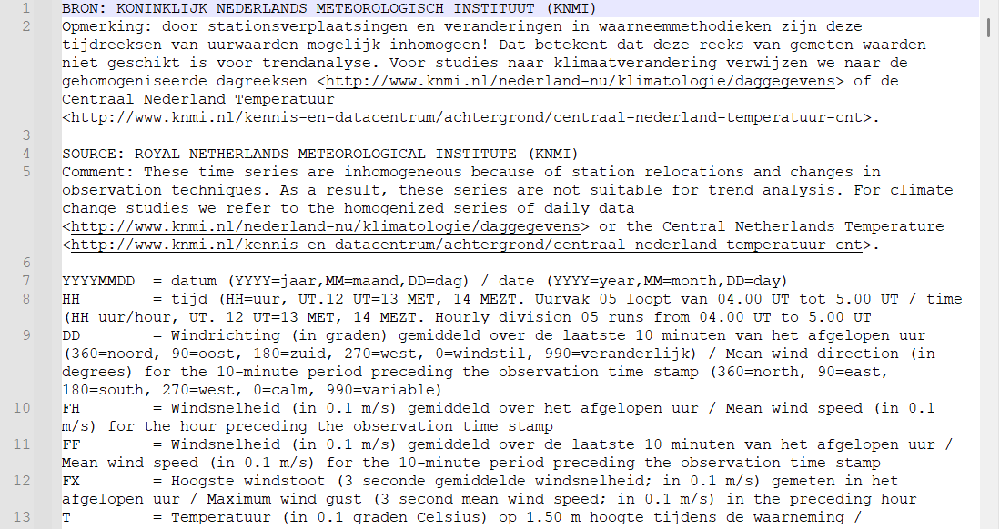

## Inleiding

In het vorige werkcollege hebben jullie gewerkt met data van grondwaterstanden uit verschillende bronnen. Daarnaast hebben jullie diverse grafieken gemaakt. Deze week gaan we aan de slag met gegevens over het weer en klimaat.

## Weerdata

Data over het weer wordt door het KNMI als open data aangeboden. Dit is tegenwoordig via <https://dataplatform.knmi.nl/>{target="_blank"} toegankelijk. De data is toegankelijk via een [API](https://nl.wikipedia.org/wiki/Application_programming_interface). Dit maakt de toegank voor een deel makkelijker, maar er is wel wat code voor nodig. Gelukkig biedt het KNMI ook data aan als eenvoudige downloads: <https://www.knmi.nl/nederland-nu/klimatologie/uurgegevens>{target="_blank"}. Hierover wordt veel uitgelegd op de website.

We gaan werken met de data uit een bepaald gebied. Laten we eens naar het zuiden van het land kijken en in Limburg op zoek gaan naar data. Op <https://www.knmi.nl/kennis-en-datacentrum/uitleg/automatische-weerstations>{target="_blank"} staat een kaartje met de locaties van alle weerstations. In Limburg is een een weerstation bij Maastricht Airport (380).

Ga naar <https://www.knmi.nl/nederland-nu/klimatologie/uurgegevens>{target="_blank"} en download de meest recente data uit Maastricht (2021-2030). Dit bestand zal `uurgeg_380_2021-2030.txt` heten.

### Project en script aanmaken

Je hebt vorig week geleerd een project aan te maken. Maak een nieuw project aan in een nieuwe map. Deze noemen we nu Grounded_WC2.

Maak ook een eerste script aan en geef deze een logische en passend naam. We beginnen weer met het aanroepen van de juiste bibliotheken. Dat zijn deze keer wederom dplyr [@wickham2023], ggplot [@wickham2016] en lubridate [@grolemund2011]. Daarnaast gaan we nieuwe libraries gebruiken: tidyr [@wickham2023a], ggpubr [@kassambara2023] en readr [@wickham2026].

```{r, warning=FALSE, message=FALSE}
# load libraries
library(dplyr)
library(ggplot2)
library(lubridate)
library(tidyr)
library(ggpubr)
library(readr)

# force non scientific formatting of numbers
options(scipen = 999)
options(digits=3)
```

### Data inlezen en de eerste verkenning van de data

Bekijk de data die je gedownload hebt in een tekst-editor. Je zult zien dat de data bestaat uit een hoop uitleg. Dat is heel fijn, omdat je meteen weet wat de data beteken.



Om de data in te kunnen lezen, plaatsen we het bestand in de `data`-map. Deze had je uiteraard al aangemaakt op basis van de les van vorige week (dat kan met code of middels bestandsbeheer).

Als we de data in proberen te lezen, zal dit niet helemaal goed gaan met het onderstaande commando.

```{{r}}
maastricht_2021_2030 <- read.csv("data/uurgeg_380_2021-2030.txt")
```

Je zult het bestand dus even goed moeten bekijken. Dan zul je erachter komen dat je een aantal regels moet overslaan bij het importeren, namelijk 31 regels.

```{r}
maastricht_2021_2030 <- read.csv("data/uurgeg_380_2021-2030.txt", skip = 31) 
```

Laten we de data even bekijken. Hieronder staan de eerste 10 regels uit de ingelezen tabel.

```{r, warning=FALSE, message=FALSE, echo=FALSE}
maastricht_2021_2030[1:10,] |> 
  kableExtra::kable()
```

Het valt op dat in de kolom RH negatieve waarde voorkomen. In het ingelezen tekstbestand lezen we:

`RH        = Uursom van de neerslag (in 0.1 mm) (-1 voor <0.05 mm)`

Dat betekent dus dat negatieve waardes wel neerslag betekenen, maar minimaal. Wanneer we dit plotten in een boxplot zie je meteen dat er veel lage waardes zijn.

```{r, warning=FALSE, message=FALSE}
maastricht_2021_2030 |> 
  ggplot(aes(x=(RH/10))) + geom_boxplot() +  labs(x = "Neerslag (mm/dag)")
```

In bovenstaande code is de neerslag getransformeerd naar millimeter per dag, omdat de meeste mensen deze eenheid herkenbaarder zullen vinden dan een neerslag in 0.1 mm.

#### Nu zelf

1.  Wat is de gemiddelde neerslag per uur? Welke standaarddeviatie hoort daarbij?
2.  Wat is de modale neerslag per uur?
3.  Maak een histogram van de neerslag per dag (in mm). Zorg daarbij dat de assen ook een duidelijke benaming krijgen.

Laten we even alle negatieve waardes omzetten naar een waarde die niets betekent, oftewel `NA`. Dat betekent dat we geen waardes hebben voor die momenten. Hiertoe zoeken we alle plekken op waar een -1 staat en vervangen dat voor `NA`:

```{r, warning=FALSE, message=FALSE}
maastricht_2021_2030[maastricht_2021_2030==-1] <- NA
```

#### Nu zelf

Als je NA in de data hebt, moet je vaak `, na.rm = TRUE` aan een functie toevoegen. Kijk maar eens in de help van `mean()`.

1.  Wat is de gemiddelde neerslag per uur? Welke standaarddeviatie hoort daarbij?
2.  Wat is de modale neerslag per uur?
3.  Op welke dag viel de meeste neerlag per uur?
4.  Maak een nieuwe boxplot van de neerslag. Zie je een verschil met die we eerder hebben gemaakt zonder de -1 te verwijderen?
5.  Maak een nieuw histogram van de neerslag per dag (in mm). Zorg daarbij dat de assen ook een duidelijke benaming krijgen.

## Grafieken maken voor de neerslag per dag

De neerslag per uur geeft al veel informatie, maar soms wil je eerder weten wat de hoeveelheden neerslag per dag was. Dat kan vrij eenvoudig door data te groeperen en de som per groep te berekenen. Laten we dat eens doen.

```{r, warning=FALSE, message=FALSE}
maastricht_2021_2030 |> 
  group_by(YYYYMMDD) |> 
  summarise(neerslagsom = sum((RH/10), na.rm = TRUE)) |> 
  ggplot(aes(x=YYYYMMDD, y = neerslagsom)) + geom_bar(stat = "Identity") +
  labs(x = "Datum", y = "Neerslag per dag (mm)")

```

Er val nu meteen op dat er een aantal pieken is, en dat die vrij ver uit elkaar liggen. Dat komt doordat het datatype van het `YYYYMMDD`-veld een integer is. Dit kun je opzoeken in R door de functie `class()` te gebruiken.

```{r, warning=FALSE, message=FALSE}
class(maastricht_2021_2030$YYYYMMDD)
```

::: callout-tip
Wil je weten wat voor gegevenstype een variabele of een bepaalde kolom in een data.frame heeft, gebruik je de functie `class()`.
:::

In het vorige werkcollege heb je al gewerkt met de functies uit de `lubridate`-package [@grolemund2011]. Aangezien het veld bestaat uit jaar-maand-dag, kunnen we de functie `ymd()` daarvoor gebruiken en een nieuw veld aan te maken dat we datum noemen.

```{r, warning=FALSE, message=FALSE}
maastricht_2021_2030 |> 
  mutate(datum = ymd(YYYYMMDD)) |> 
  group_by(datum) |> 
  summarise(neerslagsom = sum(RH/10, na.rm = TRUE)) |> 
  ggplot(aes(x=datum, y = neerslagsom)) + geom_bar(stat = "Identity") +
    labs(x = "Datum", y = "Neerslag per dag (mm)")

```

Op deze manier wordt de grafiek veel leesbaarder en lijkt ook de variatie beter inzichtelijk te zien. In het bovenstaande voorbeeld hebben we de datum aangepast bij het maken van de grafiek. Dat is voor een enkele keer handig, maar eigenlijk wat omslachtig. Dit betekent namelijk dat je dit bij iedere bewerking opnieuw moet bepalen, terwijl het handiger is om dit soort dingen in één keer aan te passen, zodat je daarna kunt werken met de bewerkte gegevens. Dat moet je dus eigenlijk meteen doen bij het inlezen van jouw bestand, zodat je daarna alle bewerkingen kunt doen, zonder steeds opnieuw de data te corrigeren. Dat geldt natuurlijk ook voor de neerslag in mm, dus dat passen we ook aan.

```{r, warning=FALSE, message=FALSE}
maastricht_2021_2030 <- read.csv("data/uurgeg_380_2021-2030.txt", skip = 31, colClasses = "integer") |>
  mutate_all(~na_if(., -1)) |> 
  mutate(datum = ymd(YYYYMMDD)) |> 
  mutate(neerslag_mm = RH/10)

```

In de bovenstaande code lezen we eerst de CSV in door `maastricht_2021_2030 <- read.csv("data/uurgeg_380_2021-2030.txt", skip = 31, colClasses = "integer")`. In dit voorbeeld zorgen we dat alle kolommen als een integer worden ingelezen, omdat deze data als zodanig wordt aangeleverd door het KNMI. Daarna vervangen we alle -1 waardes voor een `NA` door `mutate_all(~na_if(., -1))`. De laatst twee regels voegen een datum-veld en veld met de neerslag in millimeter.

Terug naar de grafiek. Als het goed is, is het je opgevallen dat er een enorme piek ergens voor 2022 zichtbaar is. Laten we eens inzoomen op de grafiek in de periode voor 2022, door alleen de data voor 2022 te selecteren:

```{r, warning=FALSE, message=FALSE}
maastricht_2021_2030 |> 
  group_by(datum) |> 
  filter(YYYYMMDD<20220000) |> 
  summarise(neerslagsom = sum(neerslag_mm, na.rm = TRUE)) |> 
  ggplot(aes(x=datum, y = neerslagsom)) + geom_bar(stat = "Identity") +
    labs(x = "Datum", y = "Neerslag per dag (mm)")
```

We zien nu dat dit ergens in juni moet zijn geweest, dus laten we eens wat meer in detail kijken naar de maand juni van 2022. Dat kan met de onderstaande code

```{r, warning=FALSE, message=FALSE}
maastricht_2021_2030 |> 
  group_by(datum) |> 
  filter(YYYYMMDD >= 20210600 & YYYYMMDD <= 20210700) |> 
  summarise(neerslagsom = sum(neerslag_mm, na.rm = TRUE)) |> 
  ggplot(aes(x=datum, y = neerslagsom)) + geom_bar(stat = "Identity") +
    labs(x = "Datum", y = "Neerslag per dag (mm)")

```

### Weer zelf aan de slag

1.  Op welke datum valt deze piek van regen?
2.  Maak een staafdiagram van de regen op deze dag, waarbij je per uur aangeeft hoe veel regen er gevallen is. Hoe laat valt de piek?
3.  Wat kun je op het nieuws vinden over deze neerslagpiek? Welke gevolgen had dit voor mensen?
4.  Welke grondwaterpunten zijn er in de buurt van de meetlocatie te vinden?
5.  Maak voor deze meetlocatie een grafiek van de grondwaterstanden. Is er een relatie te vinden tussen neerslag en grondwaterstanden?

## Temperatuur

We hebben nu een aantal grafieken gemaakt voor de neerslag, maar neerslag is niet de enige weerfactor die een bepaalde rol speelt. Er zijn er vele, zoals wind, intensiteit van de zon. Voor het overzicht groeperen we ze hieronder. Ieder heeft andere invloed op de leefomgeving. Dat betreffen:

-   Wind (-richting, -snelheid, -stoot)
-   Temperatuur (meting, gemiddeld, dauwpunt)
-   Zon (duur, straling)
-   Neerslag (duur per uur, hoeveelheid)
-   Luchtdruk
-   Zicht
-   Bewolking
-   Weersomstandigheden, zoals mist, sneeuw en onweer

Het voert te ver om al deze gegevens te gebruiken in dit werkcollege, maar je zou ze voor verschillende zaken kunnen gebruiken, zoals het bepalen van hittestress of onderzoeken welke invloed mist heeft op de hoeveelheid ongelukken. Dergelijke zaken kun je koppelen aan de inrichting van de leefomgeving en zo tot andere inzichten komen.

Laten we eens verder gaan met de temperatuur in beeld te brengen.

`T         = Temperatuur (in 0.1 graden Celsius) op 1.50 m hoogte tijdens de waarneming / Temperature (in 0.1 degrees Celsius) at 1.50 m at the time of observation`

Ook deze moeten we dus weer aanpassen naar een eenheden in graden en hadden we aan het begin bij importeren natuurlijk moeten bepalen

```{r, warning=FALSE, message=FALSE}
maastricht_2021_2030 <- read.csv("data/uurgeg_380_2021-2030.txt", skip = 31, colClasses = "integer") |>
  mutate_all(~na_if(., -1)) |> 
  mutate(datum = ymd(YYYYMMDD)) |> 
  mutate(neerslag_mm = RH/10) |> 
  mutate(temperatuur_graden = T/10)
```

Laten we eerst eens kijken hoe de gemiddelde temperatuur voor iedere dag in het jaar verloopt.

```{r, warning=FALSE, message=FALSE}
maastricht_2021_2030 |> 
  group_by(datum) |> 
  summarise(gem_temp = mean(temperatuur_graden, na.rm = TRUE)) |> 
  ggplot(aes(x=datum, y = gem_temp)) + geom_line() + labs(x="Datum", y = "Gemiddelde temperatuur (graden)") 

```

Hierin is duidelijk de trend te zien van de seizoenen. De bovenstaande grafiek geeft echter alleen de gemiddelde temperatuur, maar niet de laagste of de hoogste per dag. Dat is allemaal samen te berekenen en in een grafiek te zetten. Hiertoe moeten we eerst de data samenvatten (`summarise`) en de gemiddeldes, minima en maxima per dag te berekenen. Dan worden er aparte kolommen aangemaakt per waarde. Als we dit echter in een grafiek willen zetten en de kleuren automatisch willen maken, moeten we de kolommen omzetten naar het zogenaamde *longer*-formaat. Het commando `pivot_longer(cols = c(gem_temp, max_temp, min_temp))` zorgt ervoor dat de kolom datum behouden blijft en dat in het veld `name` de titel van de kolommen gem_temp, max_temp en min_tempkomt te staan. In het veld `value` komen de waardes te staan. Je hebt in feite de verschillende gegevens getransporteerd en naar een ander formaat omgezet:

```{r, warning=FALSE, message=FALSE}
maastricht_2021_2030 |> 
  group_by(datum) |> 
  summarise(gem_temp = mean(temperatuur_graden, na.rm = TRUE), 
            max_temp = max(temperatuur_graden, na.rm = TRUE),
            min_temp = min(temperatuur_graden, na.rm = TRUE)) |> 
  select(datum, gem_temp, min_temp, max_temp) |>
  pivot_longer(cols = c(gem_temp, max_temp, min_temp)) 
```

Dit is dan weer goed om te zetten naar een grafiek en de kleur van de lijn zal bepaald worden voor de waarde in de kolom `name`.

```{r, warning=FALSE, message=FALSE}
maastricht_2021_2030 |> 
  group_by(datum) |> 
  summarise(gem_temp = mean(temperatuur_graden, na.rm = TRUE), 
            max_temp = max(temperatuur_graden, na.rm = TRUE),
            min_temp = min(temperatuur_graden, na.rm = TRUE)) |> 
  select(datum, gem_temp, min_temp, max_temp) |>
  pivot_longer(cols = c(gem_temp, max_temp, min_temp)) |> 
  ggplot(aes(x=datum, y = value)) + geom_line(aes(colour = name)) +
    labs(x="Datum", y="Temperatuur in graden")
```

### Nu even zelf nadenken

1.  Maak de bovenstaande grafiek voor het jaar 2021.
2.  Maak dezelfde grafiek maar dan voor het jaar 2025.
3.  Maak dezelfde grafiek maar dan voor het huidige jaar (is weliswaar nog niet afgelopen).
4.  Wat valt op wanneer je de verschillende jaren vergelijkt?

We hebben een aantal trends gezien van verschillende jaren. Je zou dit ook kunnen laten zien door de data te groeperen per maand en de daggemiddeldes in een boxplot te zetten:

```{r, warning=FALSE, message=FALSE}
maastricht_2021_2030 |> 
  group_by(month(datum)) |> 
  ggplot(aes(x=month(datum), y = temperatuur_graden)) + geom_boxplot(aes(group = month(datum))) +
  labs(x="Maanden", y = "Temperatuur (graden)") 
```

Hier zijn echter de zogenaamde ticks op de x-as niet heel mooi, maar gelukkig kun je dat eenvoudig aanpassen. Dat is wel eenmalig wat typewerk. We gebruiken `scale_x_continuous` omdat de maanden worden omgezet naar een continue schaal in de software. Door de groepering maken het de eenheden echter discreet. Voor de leesbaarheid worden de tekstlabels nog even gedraaid met `+ theme(axis.text.x = element_text(angle = 90, vjust = 0.5, hjust = 1))`.

```{r, warning=FALSE, message=FALSE}
maastricht_2021_2030 |> 
  group_by(month(datum)) |> 
  ggplot(aes(x=month(datum), y = temperatuur_graden)) + geom_boxplot(aes(group = month(datum))) +
  labs(x="Maanden", y = "Temperatuur (graden)") +
  scale_x_continuous(
    breaks = 1:12,
    labels = c("Januari", "Februari", "Maart", "April", "Mei","Juni", "Juli", "Augustus", "September", "Oktober", "November", "December")
  ) +
  theme(axis.text.x = element_text(angle = 90, vjust = 0.5, hjust = 1))

```

Door deze grafiek te maken worden de meerjarige trends in de temperatuur duidelijk en begin je een idee te krijgen van het klimaat in onze regio, waarbij de zomers gemiddeld warm zijn en de winters kouder.

### Zelf aan de slag

1.  Op welke datum is de hoogste temperatuur gemeten in deze periode?
2.  Op welke datum is de laagste temperatuur gemeten?
3.  In welke jaren vielen de 10 heetste dagen?
4.  Maak een grafiek met daarin alleen temperaturen die meer dan 2 standaarddeviaties boven het gemiddelde liggen.

## Grafieken combineren

We hebben hiervoor een grafiek van de neerslag gemaakt en gezien dat in een bepaalde periode in 2021 een extreme hoeveelheid neerslag is geweest. We kunnen nu ook een grafiek maken waarbij en de neerslag en de temperatuur op die dagen te zien is. Het `ggpubr` package biedt mogelijkheden om grafieken te combineren. Hiertoe gebruiken we `ggarrange()`, waarbij de syntax is `ggarrange(grafiek_1, grafiek_2, ncol = 1)`. Op deze manier gebruikt hij twee grafieken en zet ze onder elkaar. Je kunt ze met `nrow = 1` ook naast elkaar zetten. Met deze functie kun je vele grafieken tegelijkertijd laten zien, waarbij de assen op elkaar afgestemd zijn.

```{r, warning=FALSE, message=FALSE}
ggarrange(
  maastricht_2021_2030 |> 
    group_by(datum) |> 
    filter(YYYYMMDD >= 20210600 & YYYYMMDD <= 20210715) |> 
    summarise(gem_temp = mean(temperatuur_graden, na.rm = TRUE)) |> 
    ggplot(aes(x=datum, y = gem_temp)) + geom_line() +
      labs(x="Datum", y = "Gemiddelde temperatuur per dag")
  ,
  maastricht_2021_2030 |> 
    group_by(datum) |> 
    filter(YYYYMMDD >= 20210600 & YYYYMMDD <= 20210715) |> 
    summarise(neerslagsom = sum(neerslag_mm, na.rm = TRUE)) |> 
    ggplot(aes(x=datum, y = neerslagsom)) + geom_bar(stat = "Identity") +
      labs(x="Datum", y = "Neerslagsom per dag")
  , ncol = 1
)
```

### Zelf aan de slag

1.  Maak de bovenstaande grafiek voor januari 2026. Wat valt op?
2.  Maak dezelfde grafiek, maar zet nu de neerslag boven en de temperatuur boven.
3.  Maak dezelfde grafiek, maar zorg dat de grafieken naast elkaar staan.

Het is ook mogelijk om twee verschillende grafieken te combineren in één grafiek, door bijvoorbeeld eerst een `geom_line()` te maken en daarna met andere data een `geom_bar()` hieraan toe te voegen. Op deze manier krijg je alle data samen in één grafiek. In het onderstaande voorbeeld voegen we een extra y-as toe, ter verduidelijking, met `scale_y_continuous(sec.axis = sec_axis(~.,name = "Neerslag (mm)"))`.

```{r, warning=FALSE, message=FALSE}
maastricht_2021_2030 |> 
  group_by(datum) |> 
  filter(YYYYMMDD >= 20210600 & YYYYMMDD <= 20210715) |> 
  summarise(gem_temp = mean(temperatuur_graden, na.rm = TRUE), neerslagsom = sum(neerslag_mm, na.rm = TRUE)) |> 
  ggplot(aes(x=datum, y = gem_temp)) + geom_line() +
    geom_bar(aes(x=datum, y = neerslagsom), stat = "Identity") +
    scale_y_continuous(sec.axis = sec_axis(~.,name = "Neerslag (mm)")) + 
    ylab("Temperatuur (Celsius)") 

```

Welke grafiek vind jij duidelijker? Twee losse grafieken of een gecombineerde grafiek met verschillende y-assen? En waarom?

## Klimaat: meerjarige data

We hebben nu vooral data van een enkele weerstation bekeken en de uurgegevens gecombineerd tot daggevens. Het KNMI biedt echter ook veel data aan over hele lange periodes. Het langst-functionerende weerstation is het station in De Bilt. Ga naar <https://www.knmi.nl/nederland-nu/klimatologie/daggegevens>{target="_blank"} en download daar de data van De Bilt. Het bestand heet `etmgeg_260.zip` pak het zip-bestand uit en plaats `etmgeg_260.txt` in de map met data. Lees dit bestand in en denk daarbij aan de voorgaande opdracht met betrekking tot de datum, de neerslag in mm en de temperatuur in graden. Zorg dus dat je een veld voor `datum` aanmaakt bij inlezen, een voor de neerslag in mm `neerslag_mm` en voor de gemiddelde dagtemperatuur (`temperatuur_gem_graden`). Let goed op hoeveel regels je moet overslaan

```{r, warning=FALSE, message=FALSE, echo=FALSE}
de_bilt <- read.csv("data/etmgeg_260.txt", skip = 51, colClasses = "integer") |>
  mutate(datum = ymd(YYYYMMDD)) |> 
  mutate(neerslag_mm = RH/10) |> 
  mutate(temperatuur_gem_graden = TG/10)
```

Hopelijk is dit geheel zelfstandig gelukt? Laten we eens een grafiek maken van de temperatuur van 1900 tot nu.

```{r, warning=FALSE, message=FALSE}
de_bilt |> 
  ggplot(aes(x=datum, y=temperatuur_gem_graden)) + geom_line()

```

### Zelf doen:

1.  Dit is nog niet heel duidelijk dus voeg zelf even een trendlijn toe, om de trend te zien.
2.  Dit is nog steeds niet zo mooi, dus verander de grafiek van een lijndiagram naar een spreidingsdiagram met punten.

Deze trendlijn laat goed zien dat er een opwaartse trend in de gemiddelde dagtemperatuur zit, maar echt een sterkte trend zien we niet. Hierbij speelt ook dat de temperatuur in de loop van het jaar in de verschillende seizoenen verandert. Daarom gaan we nu de data groeperen op jaar en dan de gemiddelde temperatuur per jaar berekenen en visualiseren in een grafiek. Dat doen we aldus:

```{r, warning=FALSE, message=FALSE}
de_bilt |> 
  group_by(year(datum)) |> 
  summarise(gemiddeld_jaar = mean(temperatuur_gem_graden)) |> 
  setNames(c("jaar", "gemiddelde_jaartemperatuur")) |> 
  ggplot(aes(x=jaar, y=gemiddelde_jaartemperatuur)) + geom_point(aes()) +
    geom_smooth() + labs(x="Jaar", y="Gemiddelde jaartemperatuur")

```

Let hierbij op, want door te groeperen en daarna een gemiddelde te berekenen heeft de kolom met het jaar een nieuwe interne naam gekregen die onhandig is. Daarom helpen we onszelf door de beide kolommen een nieuwe naam te geven met de functie `setNames(c("jaar", "gemiddelde_jaartemperatuur"))`.

De nu gemaakte grafiek laat een veel sterkere verandering van het klimaat zien en dat de gemiddelde jaartemperatuur sinds de jaren '60 zeer sterk is gestegen, iets wat we kennen als klimaatverandering.

### En dan weer zelf aan de slag

1.  Maak een grafiek van de gemiddelde jaarlijkse neerslag. Zijn daar trends in te zien?
2.  Maak een visualisatie van zowel de grafiek met de gemiddelde jaarlijkse temperatuur en die van de neerslag, waarbij deze grafieken boven elkaar staan.
3.  Er zijn bepaalde trends zichtbaar. Wat betekent dat voor jouw onderzoeksgebied? Welke aanpassingen zijn nodig in het onderzoeksgebied?

## Historische klimaatdata toevoegen

De metingen in De Bilt worden sinds 1901 goed bijgehouden, maar er bestaan ook oudere metingen, welke ons een goed beeld kunnen geven van de veranderingen van het klimaat over de afgelopen eeuwen. Deze biedt het KNMI ook kostenloos aan via: <https://www.knmi.nl/nederland-nu/klimatologie/daggegevens/antieke-waarnemingen>{target="_blank"}. Ze bieden diverse data-bronnen aan en we gebruiken nu de langstlopende uit Utrecht: <https://cdn.knmi.nl/knmi/map/page/klimatologie/gegevens/daggegevens/antieke_wrn/labrijn_ea.zip>{target="_blank"}. Pak deze zip uit en plaats het bestand `labrijn_ea.dat` in de `data`-map.

Het bestand `labrijn_ea.dat` lijkt een wat exotisch formaat, maar als je deze in een tekst-editor bekijkt, lijkt het gewoon een soort CSV-bestand, maar dan met een andere extensie.


Het is opvallen dat de data niet door een symbool wordt gescheiden, maar dat er gebruik gemaakt wordt van vaste kolombreedtes. Dat is niet goed in te lezen met `read.csv()`, maar gelukkig zijn er andere tools. De readr-library [@wickham2026] heeft de functie `read_fwf()` die gemaakt is voor het inlezen van fixed-width-files. De titels van de velden staan weer wat onhandig met gewoon inlezen, dat de die eerst skippen en daarna opnieuw aanmaken met `setNames()`

```{r, warning=FALSE, message=FALSE}
labrijn <- read_fwf("data/labrijn_ea.dat", skip = 22) |> 
  setNames(c("Jaar", "Jan", "Feb", "Mar", "Apr", "May", "Jun", "Jul", "Aug", "Sep", "Oct", "Nov", "Dec", "Year_temp", "Win", "Spr", "Sum", "Aut"))
```

Met deze data kunnen we nu eenvoudig verschillende grafieken maken. Laten we beginnen met de gemiddelde jaartemperatuur, met een langjarige trendlijn.

```{r, warning=FALSE, message=FALSE}
labrijn |> 
  ggplot(aes(x=Jaar, y=Year_temp/10)) + geom_point() + geom_smooth() +
    labs(y="Gemiddelde temperatuur")
```

Nu wordt nog duidelijker welke enorme gemiddelde opwarming van de aarde op dit moment gaande is en dat die met name sinds het midden van de twintigste eeuw uitermate hard stijgt. We zien ook een grote variatie van jaar tot jaar, maar dat de afgelopen jaren de variatie eigenlijk steeds minder aan het worden is

Het is ook mogelijk om eens te kijken of de temperaturen in de verschillende seizoenen in deze dataset anders toenemen. Daartoe moeten we weer gebruik maken van de `pivot_longer()` optie. Daarnaast zijn alle temperaturen weer in 0.1 graden Celsius, dus ook hier weer omrekenen. Door de kleur te bepalen bij de *aesthetics* bij het aanroepen van ggplot, worden de trendlijnen automatisch per seizoen bepaald.

```{r, warning=FALSE, message=FALSE}
labrijn |> 
  pivot_longer(cols = c("Win", "Spr", "Sum", "Aut")) |> 
  ggplot(aes(x=Jaar, y=value/10, colour=name)) + geom_point() + geom_smooth() +
  labs(y="Gemiddelde temperatuur")
```

Als je de de kleur alleen voor de punten instelt (bij `geom_point()`), zal de algemene trendlijn van alle seizoenen worden bepaald. Dat is in dit geval net geheel logisch, maar kan wel.

```{r, warning=FALSE, message=FALSE}
labrijn |> 
  pivot_longer(cols = c("Win", "Spr", "Sum", "Aut")) |> 
  ggplot(aes(x=Jaar, y=value/10)) + geom_point(aes(colour=name)) + geom_smooth() +
  labs(y="Gemiddelde temperatuur")
```

Deze laatste trendlijnen in de grafiek is dus minder goed en vertelt ook minder duidelijk een verhaal.

### En nu zelf weer aan de slag.

1.  Pas legenda van de grafiek met de trendlijnen per seizoen aan en zorg dat deze een duidelijke titel krijgt en dat de namen van de seizoenen uitgeschreven worden. Tip: maak gebruik van `scale_color_discrete()`.

2.  Maak dezelfde grafiek maar dan voor de verschillende maanden van het jaar. Welke maanden laten de grootste veranderingen zien?

3.  Wat was eigenlijk de warmste maand van de afgelopen eeuwen?

4.  Wanneer waren de warmste 10 maanden?

5.  Wanneer waren de koudste 10 maanden?

    **Extra**

6.  Het WMO publiceert een hele bekende grafiek met de zogenaamde *Warming stripes* (<https://wmo.int/site/science-action/warming-stripes>{target="_blank"}). Dit laat de temperatuurverschillende zien ten opzichte van de gemiddelde temperatuur tussen 1850 en 1900 (<https://wmo.int/media/news/wmo-publishes-global-update-of-climate-datasets>{target="_blank"}). Maak een lijndiagram voor de periode 1850 tot nu die hetzelfde laat zien op basis van de `labrijn` dataset.

7.  Lukt het ook om de *warming stripes* voor Nederland te maken?

## Project

Denk voor het eigen project na over de volgende vragen.

-   Welke invloed heeft het weer op de problemen in mijn onderzoeksgebied?
-   Welke invloed heeft het klimaat op de problemen in mijn onderzoeksgebied?
-   Welke klimaatsdata heb ik nodig voor mijn onderzoek?
-   Er zijn diverse klimaatscenario's (<https://www.knmi.nl/kennis-en-datacentrum/achtergrond/knmi-23-klimaatscenario-s>{target="_blank"}). Welke invloeden kan je voor de toekomst onderscheiden die invloed hebben op het onderzoeksgebied?

Ga vast aan de slag om de relevante data te verzamelen en maak de benodigde analyses en grafieken.

